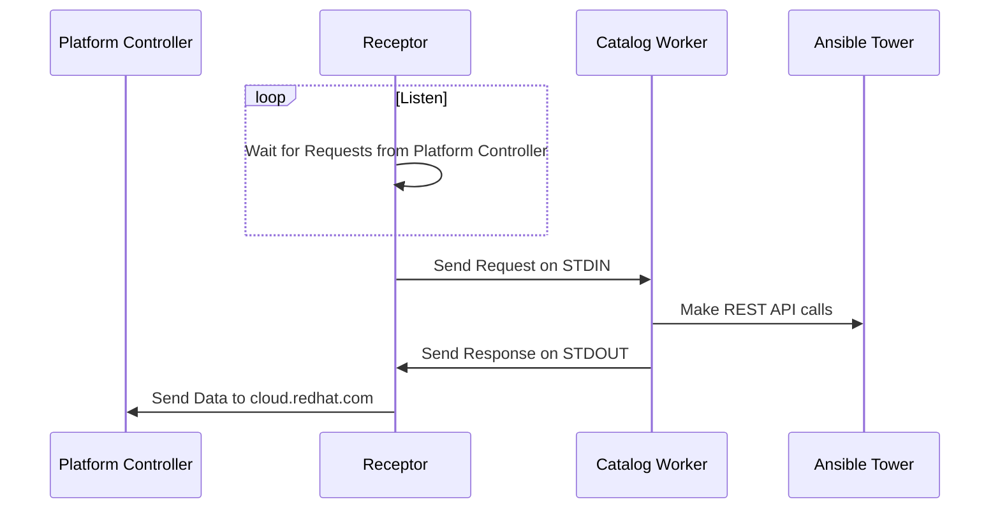

# Catalog Worker

The Catalog Worker runs under the Receptor and talks to an on-prem Ansible Tower and fetches

 1. Job Templates
 2. Inventories
 3. Credentials
 4. Credential Types
 5. Survey Spec
 6. Workflow Templates

# Input Parameters for Catalog Worker

 1. Debug
 2. Tower Token
 3. Tower URL

# Request Parameters for Ansible Tower
|Keyword| Description | Example
|--|--|--
|**href_slug**| The Partial URL (required) |/api/v2/job_templates
|**method**| One of get/post/monitor (required) | get
|accept_encoding| Compress Response | gzip
|fetch_all_pages| Fetch all pages from Tower for a URL | true
|apply_filter|JMES Path filter to trim data | **results[].{id:id, type:type, created:created,name:name**
|params| Post Params or Query Params|

## Sequence Diagram

## Option Config File in Receptor (/etc/receptor/receptor.conf)

**- work-command:**

**worktype:  catalog**

**command: /tmp/catalog_worker**

**params: --skip_verify_ssl --token <<tower_token>> --url <<tower_url>>**
